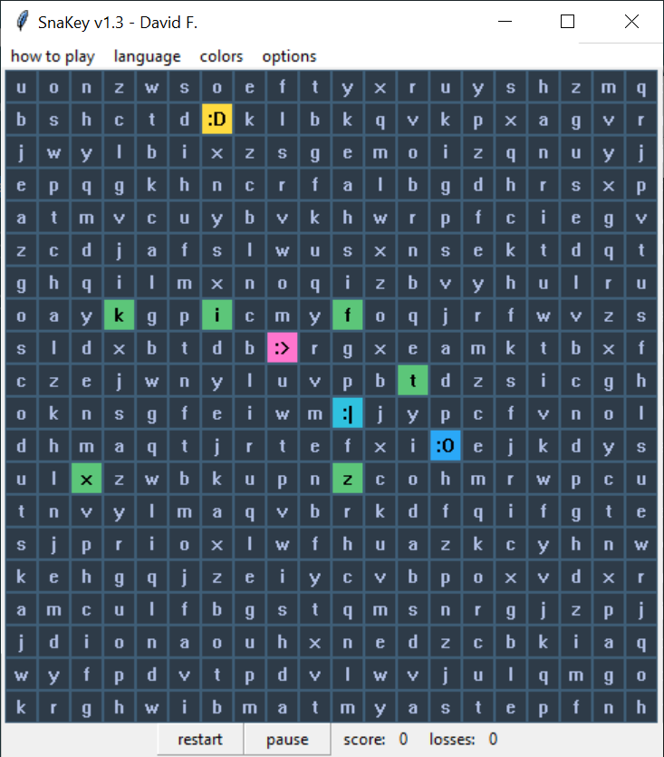

# :snake::computer: SnaKey

[click here to play](index.html)

## Contents

- [Introduction](#train-introduction)
  - [Version #1](#version-1-born-on-a-python)
  - [Version #2](#version-2-slithering-to-the-web)
  - [Version #3](#version-3-you-are-here)
  - [Design Challenges](#design-challenges)

## :train: Introduction

### Version #1 - Born on a Python

 I wrote the bulk of [the first version of this game](https://github.com/david-fong/SnaKey) in the February of 2018 using Python. At the time, I had pretty much just finished [learning Python over the Winter break](https://github.com/david-fong/Tetris), and I wanted to do something original with it. I came up with the start of an idea spinning off of the classic [Snake Game](https://wikipedia.org/wiki/Snake_(video_game_genre)), with a twist on the movement mechanic: to move by typing. In this version, there were color themes, basic language support (Japanese Hiragana and Katakana), and basic computer-opponents.

The idea of adding different languages came because I was taking a beginners class in Japanese, and needed to learn its basic alphabets. I really enjoyed that class- not just because I was interested in the content, but also because the prof was a kind person and a good teacher. Helping people practice recognizing characters from other languages has become a big motivator for my continued work on this game.

A major theme for this version was baseline design. I came up with a representation for language mappings, maintaining necessary invariants, and designing movement algorithms for the artificially controlled opponents. On the less technical side, I also spent a lot of effort deciding what the game objective should be to motivate the player to keep moving around: The player had to run from a chaser, compete with another target consumer, and could choose to try and catch a run-awayer to slide a notch down on the increasing difficulty ramp.

### Version #2 - Slithering to the Web

 I finished that version, and excitedly showed my friends and my Japanese prof. Some were pretty enthusiastic about it. My prof was, but didn't know how to run it on her computer (and I didn't know either because I was a newbie to Python). And so, I decided that I wanted to try and make it more accessible. I started reading about how basic webpages are built up using HTML, JavaScript, and CSS, and I slowly worked on porting the game to be hosted on the web via GitHub-Pages as [the second version of this game](https://github.com/david-fong/SnaKey-JS).

In this version, which I wrote the bulk of in March of 2018, I wrote everything using NotePad++, and used pure HTML, Javascript, and CSS. Looking back, I think this really set me up with a good foundational understanding of how things worked, as opposed to what might have been the case if I started looking at various frameworks and transpiling languages right away. It has also made me appreciate the value of strong typing, and choosing conventions for things such as naming. Javascript is really so slack when it comes to such basic things that it's easy to write things that don't read well or make much sense.  Learning was a major theme of my work in this version. Unlike the first version where I had already learned the basics of the language and how it runs, here I was learning from scratch all over again. The majority of my efforts went to learning how to port over the behaviour of the previous version by learning about the interfaces to javascript's basic data structures, manipulating the browser DOM, and working with CSS. I found [w3c schools](https://www.w3schools.com/) and [MDN web docs](https://developer.mozilla.org/en-US/) to be great learning resources. There were very few changes to the underlying representation and game objectives and mechanics.

### Version #3 - You are Here

This brings us to where we are now- around November of 2019. The goal of this version is to push the game out to the world of internet-enabled multiplayer. Although I've recently gotten comfortable [working in the terminal environment](https://github.com/david-fong/Darcy), for this project, I decided to try using VSCode, since it looked like it would offer good intellisense for TypeScript, which I was looking to learn to use. I spent significant time learning how to set up linting for TypeScript with VSCode, and learning about ES6's native module system. I was really impressed with how good the integration is between VSCode and various plugins and typing constructs.

I envision this version to be this game's last "remake"- not at all because I'm tired of it, but because I finally have the tools and level of understanding of the language and how it executes to build up a maintainable code base. In previous versions, the code was not as well abstracted / composed as I would have liked it to be. This was because I was just starting to learn about web development and didn't know about the native module specification for javascript. And because I chose not to work with an IDE in the second version, as a developer, it was easy to make mistakes even with my own interfaces. On top of those, documentation was not a huge priority for me at the time, which has really changed since then. I am determined to address all those problems in this version, and I am confident that I can!

I aim to make something that meets my own standards of quality, and that can guide any interested reader through my process. This is why I want to stress that I could not have made it here without all the work that I have done and the encouragement I have received before. As I write this, this version has not yet been finished. There are two visions that really motivate me to keep at this project: that one day I will play it with my friends, and that it can help a class of students starting to learn a new language like Japanese.

### Design Challenges

One of the big challenges for this project is to give the user the choice between playing completely offline (after fetching all the game's HTTP objects), and playing online. I like this challenge because it really demands designing a good function API, and working with inheritence to share as much code as possible. This isn't a trivial task given an overview of what each piece of the picture needs to accomplish:

|                                            | Offline | Server | Client |
:-------------------------------------------:|:-------:|:------:|:------:|
| Maintain the master copy of the game state | :heavy_check_mark: | :heavy_check_mark: | :heavy_multiplication_x: |
| Display the game state via the browser DOM | :heavy_check_mark: | :heavy_multiplication_x: | :heavy_check_mark: |
| Use network operations to exchange events  | :heavy_multiplication_x: | :heavy_check_mark: | :heavy_check_mark: |
