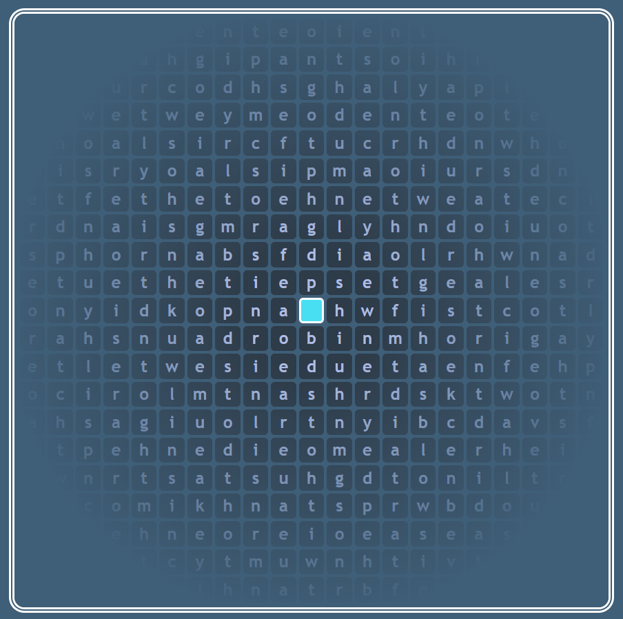

# ⌨🐍 SnaKey

[**`Try it!` 👈**](https://david-fong.github.io/snakey3/)

SnaKey is a typing game where you move around by typing keyboard sequences corresponding to characters from written languages. For example, playing with English, if there was a tile adjacent to your player character marked by the written character "a", to move on it, you would type the keyboard sequence "a". If you were playing with Japanese Hiragana, you would type the keyboard sequence "no" to move onto an adjacent tile marked by the written character "の". It's easier done than said.

SnaKey drew some initial inspiration from the well-known [Snake Game](https://wikipedia.org/wiki/Snake_(video_game_genre)), hence its name, which is a pun on the words "snake" and "keyboard".

## Contents

- [Contents](#contents "Legends say they are still clicking to this very day.")
- [Looking Back and Looking Forward](#-looking-back-and-looking-forward)
  - [Version #1 - Born on a Python](#-version-1---born-on-a-python)
  - [Version #2 - Slithering to the Web](#-version-2---slithering-to-the-web)
  - [Version #3 - Snakes With Wings](#-version-3---snakes-with-wings-you-are-here)
- [Design Challenges](#-design-challenges)
- [Language Representation](#language-representation)

## What Makes this Project Meaningful

1. To me, it is my baby. I'm so happy that I can call this idea my own, and I find a lot of fulfilment in working toward an image of its completion. Through it, I've continually been pushing myself to learn new things and to do things better.
1. To anyone who plays it, I hope it can be three things:
    - Something fun to play with friends 🙂
    - A way to practice typing, and to practice recognizing characters from various supported languages.
    - A reminder of how learning is difficult, and yet that you and I have proven that we can overcome that difficulty. Yes, I said that working on this project is immensely fulfilling, but the sheer amount of learning it entails also brings me a proportional helping of frustration. I have to keep reminding myself to be patient with the process and to be kind to myself. I want you to remember to do that too!

## 🚋 Looking Back and Looking Forward

This is a non-technical section to reflect on my previous work on this project.

### 🐍 Version #1 - Born on a Python

I wrote [**version one**](https://github.com/david-fong/SnaKey) of this game in one week of the February of 2019 using Python. I had just finished [learning it](https://github.com/david-fong/Tetris), and I wanted to use it for something original.

I designed the game by asking myself the question _"How can I make it fun for a single player to keep moving around?"_. As the main objective, I randomly spawned apples to collect for score points. To add a sense of ramping pressure, I made an enemy chaser, for competition, an enemy apple collector, and for an extra challenge and reward, an avoider that grants a bonus whenever caught.

The inspiration to add different languages came by taking a beginners' class in Japanese. I really enjoyed it- for interest in the content, and because the professor was a kind person, and a good teacher. That positive learning experience has continued to guide my vision for this game.

### 🕸 Version #2 - Slithering to the Web

I excitedly showed version one to my friends and Japanese prof, who responded with enthusiasm and encouragement, and confirmed my fears of poor accessibility. For that reason, over the next month, I learned how to build simple web-pages to port the game to [**version two**](https://github.com/david-fong/SnaKey-JS).

I wrote everything (with hands tied behind my back on NotePad++) in vanilla HTML, Javascript, and CSS. This helped me to build a strong foundation and appreciate the value of a good IDE, strong typing, and style conventions (which pushed me to VsCode, TypeScript, and EsLint in version 3).

The game's objectives, mechanics, and representation went largely unchanged. Being back at square one, most of my efforts went to searching through and exploring documentation on javascript's basic data structures, the browser DOM, and CSS. I found [w3c schools](https://www.w3schools.com/) and the [MDN web docs](https://developer.mozilla.org/en-US/) to be great learning resources.

### 🌐 Version #3 - Snakes With Wings (You are Here)

This brings us to where we are now: November of 2019 and onward. The goal for this version is to implement internet-enabled multiplayer. Although I had recently gotten comfortable [working in a terminal environment](https://github.com/david-fong/Darcy), I decided to try VSCode for the first time, and have absolutely not regretted it.

You might think that after making this game twice I'd be tired of it... but that couldn't be further from the truth! I see so many opportunities to improve on my previous work- to make it more accessible, organized, and more fun. I can't wait for the day when I can sit down and play it with a group of friends, or perhaps even with complete strangers.

---

## 🛩 Design Challenges

See [dedicated readme](./src/#source-code).

## Language Representation

See [dedicated readme](./src/base/lang/)
